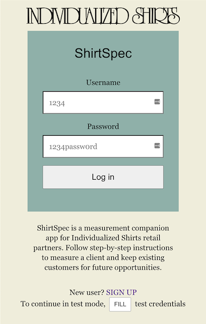
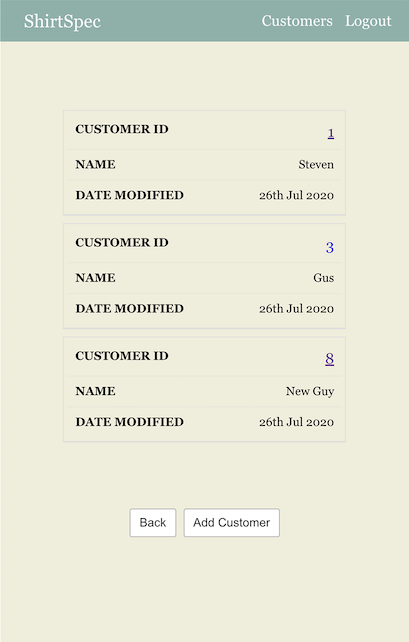
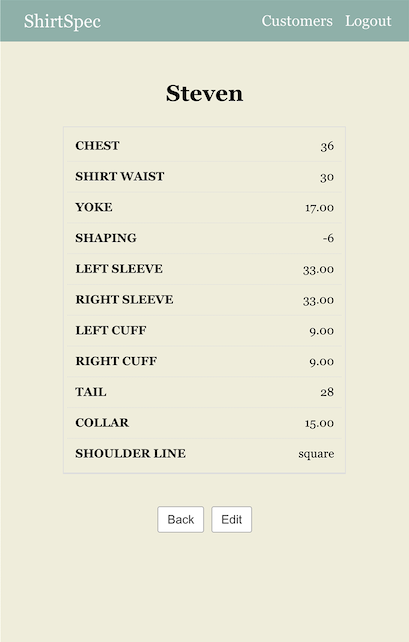
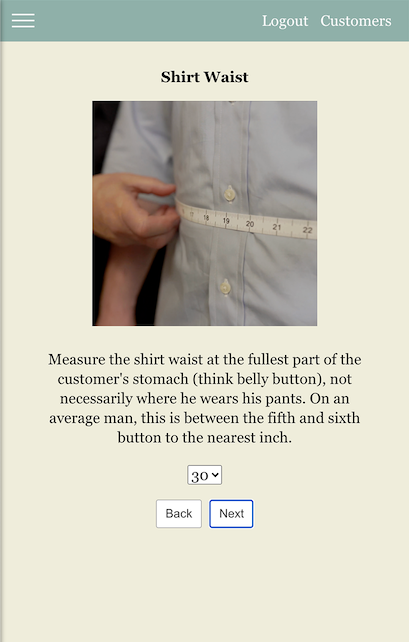
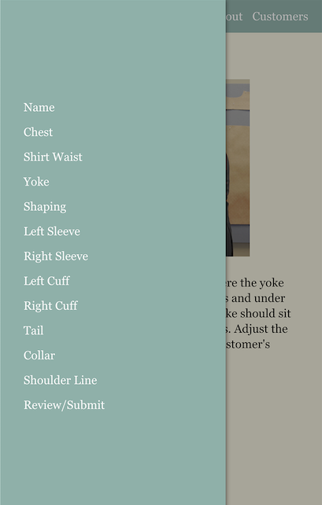

<!-- # ShirtSpec API-->
# ShirtSpec API

ShirtSpec is a measurement companion app for Individualized Shirts retail partners. Designed specifically with new trainees in mind, ShirtSpec guides fitters through the custom shirt fitting process ensuring that they accurately record key values within the scope of the nation's most comprehensive custom shirt program.

## Motivation

I have personally been an IS partner for nearly a decade now, and though the fitting program has advanced and become more detailed/thorough, the online ordering portal has significantly lagged behind. This project truly is the earliest, minimal iteration in what I hope can become a worthy successor to the current online order form. There's a long way to go from here--measurement validations are the most pressing need at the moment, but to replace the ol' fax machine we haven't even scratched the surface.

## Build Status

Version 1.0 gets the customers and their measurements on the board for a given store (aka "retail partner"). At the moment, customer edits take precedence as generally MTM customers are loyal to program and repeat business, so no immediate need to delete customers. For new fitters, measurement logic/validations will be most valuable to this project, which is in-progress. Thankfully the current training program has these measurement limits and warnings well-documented, so it's just a matter of transcribing them--time consuming, nonetheless.

## Endpoints

* GET
    * `/api/customers` returns all customers for logged in user/store ONLY
    * `/api/customers/:customerId` returns the customers measurements

* POST
    * `/api/login` for login/authentication via JWT
    * `/api/customers` to add a new customer complete with measurements
    * `/api/stores` to register as a new store (user)

* PATCH 
    * `/api/customers/:customerId` to update any customer details

## Screenshots
Landing Page/Log In



Customers Screen:



Customer Info: 



Measurement Instruction Page



Responsive Nav/Sidebar



Review/Submit Page


## Built With

### Back-End
* Node and Express
    * Authentication via JWT
    * RESTful API

### Testing
* Supertest (Integration)
* Mocha (Unit)
* Chai (Unit)

### Database
* Postgres
* Knex.js - SQL wrapper

### Production
* Deployed via Heroku

## Upcoming features
 
* DELETE: Delete a customer `/api/customers/:customerId`
* GET: Fabric availability `/api/fabrics`

## Demo

- [Live Demo](https://shirtspec-app.vercel.app/)

## Getting Started

Major dependencies for this repo include Postgres and Node.

Clone this directory to your machine, `cd` into the directory and run `npm install` to load dependencies

Create dev and test databases: `createdb -U postgres -d shirtspec` and `createdb -U postgres -d shirtspec-test`

Create a `.env` file in the project root and include the following:

````
NODE_ENV=development
PORT=3000
DATABASE_URL="postgresql://postgres@localhost/shirtspec"
TEST_DATABASE_URL="postgresql://postgres@localhost/shirtspec-test"
JWT_SECRET="<your-secret-here>"
````

`npm run migrate` or `npm run migrate:test` to build/seed tables to respective database.

To test, run `npm t`

To start the server, `npm run dev`

This repository only contains the back-end server. To view the client code, see the repository below:

[https://github.com/StevieReyJuan/ShirtSpec](https://github.com/StevieReyJuan/ShirtSpec)

## Authors

* **S. Reyes** - Development

## Acknowledgments

* **Mario Mol** - My mentor--Can't thank you enough for your guidance. 

* **David Dumont** My IS rep. Thanks for the resources!